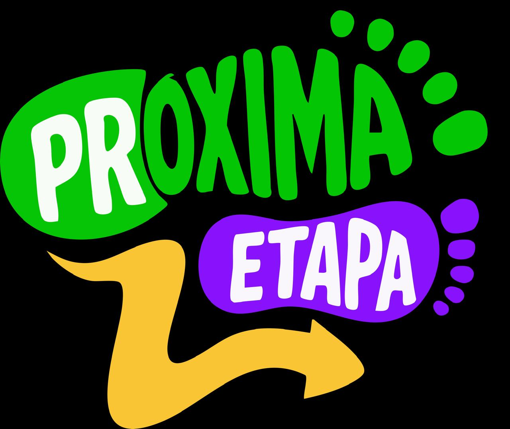

# FECAP - Fundação de Comércio Álvares Penteado

<p align="center">
<a href= "https://www.fecap.br/"></a>
</p>

# KLMDD

## Integrantes: <a href="https://www.linkedin.com/in/danilooliveiradealmeida">Danilo Almeida</a>, <a href="https://www.linkedin.com/in/katiely-silva-264387295/">Katiely Silva</a>, <a href="https://www.linkedin.com/in/laura-pelizzer-b928142b4/">Laura Pelizzer</a>, <a href="https://www.linkedin.com/in/matheus-quio-2797b4301/">Matheus Quio</a>

## Professores Orientadores: <a href="https://www.linkedin.com/in/eduardo-savino/">Eduardo Savino Gomes</a>, <a href="https://www.linkedin.com/in/ronaldo-araujo-pinto-3542811a/">Ronaldo Araujo Pinto</a>, <a href="https://www.linkedin.com/in/francisco-escobar/">Francisco Escobar</a>, <a href="https://www.linkedin.com/in/adriano-valente/">Adriano Valente</a>, <a href="https://www.linkedin.com/in/jbuesso/">José Carlos Buesso Junior</a>

---

## Descrição
## 📖 Sobre o Projeto

<p align="center">
  
</p>

<h1 align="center">Próxima Etapa</h1>

<p align="center">
  Aplicativo mobile de apoio aos estudantes atendidos pela ONG Próxima Etapa
  \nO Próxima Etapa é um projeto social que visa auxiliar ....
</p>

---

## 🛠️ Tecnologias Utilizadas

- Java
- Android Studio
- Android SDK
- ConstraintLayout
- Figma

---

## 📁 Estrutura de Pastas

```
Raiz
├── documentos
│   └── Entrega 1
│   └── Entrega 2
├── executáveis
│   └── android.apk
├── imagens
├── src
│   ├── Backend
│   └── Frontend
└── README.md
```

| Pasta | Conteúdo |
|---|---|
| `documentos` | Documentação do projeto |
| `executáveis/android` | Arquivo APK do aplicativo |
| `imagens` | Imagens e recursos visuais usados |
| `src/Backend` | Código-fonte do Backend |
| `src/Frontend` | Código-fonte do Frontend (telas e layouts) |

---

## 📲 Instalação

### Requisitos

- Dispositivo Android 8.0 (API 26) ou superior
- Arquivo APK do aplicativo (disponível em `executáveis/android`)

### Instalando o APK

1. Faça o download do arquivo `ProximaEtapa.apk`;
2. Transfira o APK para o dispositivo Android, caso necessário;
3. Abra o arquivo APK;
4. Caso solicitado, habilite a opção **"Instalar aplicativos de fontes desconhecidas"**;
5. Conclua a instalação;
6. Abra o aplicativo **Próxima Etapa** e utilize normalmente.

---

## 💻 Executando o Projeto no Android Studio

1. Clone este repositório:

   ```bash
   git clone https://github.com/2026-2-NADS3/Projeto5.git
   ```

2. Abra o projeto no Android Studio;
3. Aguarde o download das dependências do Gradle;
4. Conecte um dispositivo Android ou inicie um emulador;
5. Entre na pasta documentos -> Entrega1 -> ProgramacaoMobile
6. Execute o projeto através do botão **Run** ▶️.


## 📋 Licença/License
<p align="center">
  <br>
  <strong>Próxima-Etapa © 2026</strong> <br>
  Desenvolvido por: <a href="https://www.linkedin.com/in/danilooliveiradealmeida">Danilo Almeida</a>, <a href="https://www.linkedin.com/in/katiely-silva-264387295/">Katiely Silva</a>, <a href="https://www.linkedin.com/in/laura-pelizzer-b928142b4/">Laura Pelizzer</a>, <a href="https://www.linkedin.com/in/matheus-quio-2797b4301/">Matheus Quio</a>
</p>

<p align="center">
  <a rel="license" href="http://creativecommons.org/licenses/by-nd/4.0/">
    
  </a>
  <br>
  <small>Este trabalho está licenciado sob uma <a rel="license" href="http://creativecommons.org/licenses/by-nd/4.0/">Licença CC BY-ND 4.0</a></small>
</p>
<br>

## 🎓 Referências

Aqui estão as referências usadas no projeto.

1. <https://github.com/iuricode/readme-template>
2. <https://github.com/gabrieldejesus/readme-model>
3. <https://chooser-beta.creativecommons.org/>
4. <https://freesound.org/>
5. <https://www.toptal.com/developers/gitignore>
6. Músicas por: <a href="https://freesound.org/people/DaveJf/sounds/616544/"> DaveJf </a> e <a href="https://freesound.org/people/DRFX/sounds/338986/"> DRFX </a> ambas com Licença CC 0.

